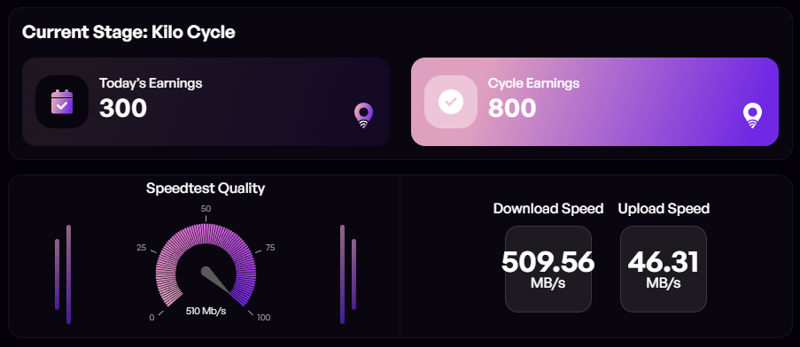
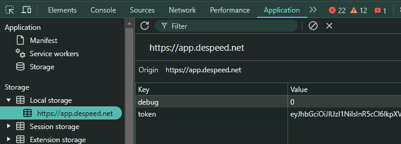

# DeSpeed Bot auto send report speed test quality


- website : [https://despeed.net](https://app.despeed.net/register?ref=EHP3FKKlEsK4)

## Features

- **Auto Send Report SpeedTest Quality**
- **Auto Daily CheckIn**
- **Support Multy Accounts**
- **Support Proxy usage**
- **There have limit 4 time to send speedtest result each day** so better to create a lot accounts
 
## Prerequisites

- Node.js installed on your machine
- Despeed token follow instruction to get:
- Register here : [https://despeed.net/](https://app.despeed.net/register?ref=EHP3FKKlEsK4)
- login and inspect or F12 find application
- in local storage find token and copy all value
    

## Installation

1. Clone the repository:
    ```sh
    git clone https://github.com/Zlkcyber/despeedBot.git
    cd despeedBot
    ```

2. Install the required dependencies:
    ```sh
    npm install
    ```
3. paste tookens in `tokens.txt` 1 token per line
    ```bash
    nano tokens.txt
    ```
4. paste proxy in `proxy.txt`:
-  format `http://username:password@ip:port` or `socks5://username:password@ip:port`
    ```sh
    nano proxy.txt
    ```
5. Run the script:
    ```sh
    npm run start
    ```

## 

This project is licensed under the [MIT License](LICENSE).
